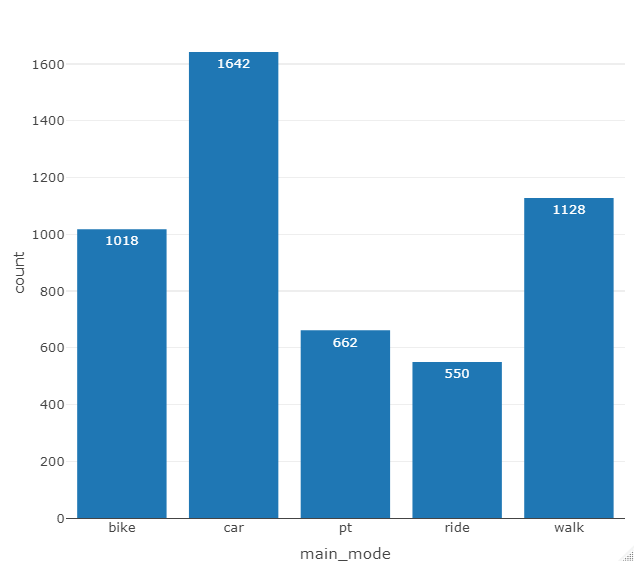

```{r, include=FALSE}
knitr::opts_chunk$set(
  collapse = TRUE,
  comment = "#>"
)
```

The data used in this example project can be found on the [public repository] (https://svn.vsp.tu-berlin.de/repos/public-svn/matsim/scenarios/) from VSP Berlin. There you can also find other MATSim scenarios.

#### Introduction

This vignette offers an example workflow from MATSim output to thematic plots and maps. For a general overview of the package and its structure please read the introduction.

A short recap however: functions are divided into four categories and start with a respective prefix. Read_, process_, plot_ or compare_ and in the future simwrapper_.
To better understand the naming conventions (for example to create your own functions) consult this vignette [LINK].

#### Installation

MATSim R is not yet available at CRAN, so to install MATSim R using github, use the following code.

```{r install master,eval=FALSE}
devtools::install_github("matsim-vsp/matsim-r")
```


#### Loading the package

Once installed, you can load the MATSim R package using the library() function:
```{r,eval=FALSE}
library(matsim)
library(sf)
```


#### Loading data

The data we'll use in this example project is the result of a Leipzig run which you can find under the following link. (https://svn.vsp.tu-berlin.de/repos/public-svn/matsim/scenarios/countries/de/leipzig/projects/namav/base-case/) 

If you want to follow along, download a copy of the folder.

To start, we will load the output_trips.csv.gz file. It is a zipped file, but that is okay, the functions can handle that. We will also load a shape file, which can be found here.  (https://svn.vsp.tu-berlin.de/repos/public-svn/matsim/scenarios/countries/de/leipzig/leipzig-v1.1/input/shp/)

```{r,eval=FALSE}
 trips_file_path <- "paste_file_path_here"
 
 # if you don't want to immediately load the whole file, the function read_output_trips has the option to only load the first n lines 
 output_trips <- read_output_trips(trips_file_path, n_max = 5000)
```


#### Plot a modal split

There are two functions to calculate and plot modal splits: `plot_mainmode_piechart()` and `plot_mainmode_piechart()`. As the name suggests the first one plots the modal split as a pie chart and the second one as a bar chart. To do this, they use the processing function `process_get_mainmode_distribution()` and plot the resulting table. The processing function can also be used on its own to just get the raw numbers.

We are going to plot a bar chart:

```{r,eval=FALSE}
 plot_mainmode_barchart(output_trips)
```

The resulting bar chart looks like this:



#### Spatial filter

In a next step we want to spatially filter our data. So far we have been looking at all the trips in the simulation, now we want to focus on those that touch our project area.

To do this we can use the function `process_filter_by_shape()` and the shape file we've already loaded. The parameter `crs` is the coordinate system number and the spatial_type describes the way the trips interact with the project area. The four options are inside, outside, originating and destinating. In this case we will look at the originating trips.

```{r, eval = FALSE}
trips_originating <- process_filter_by_shape(output_trips, leipzig_shp, crs = 25832, spatial_type = "originating" )
```

Using `plot_mainmode_barchart()` on the 507 originating trips, results in the following chart:


#### Comparison plots

In a next step we will compare the modal split of this base model with the modal split of a scenario. To do this we need to load the output_trips file from a scenario, e.g. this one. https://svn.vsp.tu-berlin.de/repos/public-svn/matsim/scenarios/countries/de/leipzig/projects/namav/drt-outskirts/ 

```{r, eval = FALSE}
#loading the scenario data
output_trips_scenario <- read_output_trips(trips_file_scenario_path, n_max = 5000)

#filtering the scenario data
trips_scenario_originating <- process_filter_by_shape(output_trips_scenario, leipzig_shp, crs = 25832, spatial_type = "originating")

#creating the comparison plot
plot_compare_mainmode_barchart(trips_originating, trips_scenario_originating)
```

The resulting plot looks like this:


#### Maps

The package also allows the plotting of spatial data. As an example we can plot the trips originating in the project area to see where they end.

```{r,eval=FALSE}
plot_map_trips(trips_originating, crs = 25832)
```

The result is an interactive map using leaflet, showing the places of origin in blue and the destinations in red. (The following image is a screenshot)


