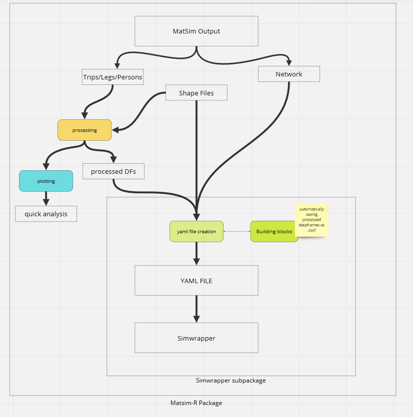

```{r, include = FALSE}
knitr::opts_chunk$set(
  collapse = TRUE,
  comment = "#>"
)
```

```{r setup, warning = FALSE}
library(matsim)
```

#### Introduction
Welcome to the MATSim R package! MATSim R is an R package designed for data processing and visualization and provides a wide range of functions to create adjustable plots from processed data. This vignette will give you an overview of the structure of the package and quickly guide you through the process of creating plots using the functions provided by the library. 

#### Overall concept

The purpose of this package is to provide a comprehensive set of tools to efficiently analyze the output of MATSim runs. The package primarily processes output data stored in CSV and XML files, especially the so called "output_trips", "legs" and "persons" files. By adhering to this standardized naming convention, the package offers a streamlined functionality for reading, processing, plotting and YAML file creation for use in Simwrapper. XXXX LINK TO SIMWRAPPER GITHUB xxxx



The package is organized into four categories, each serving a specific purpose:

**Reading Functions**: These functions begin with the prefix "read_" and are designed to read and import the simulation output. Field types are automatically set and a tibble is created.

**Processing Functions**: Functions with the prefix "process_" form the core of the package's data manipulation capabilities. Users can apply a variety of transformations and calculations to the loaded tibbles, allowing for advanced processing and analysis tailored to their specific needs. Spatial input/output is also supported, enabling users to manipulate and analyze the data on a spatial level as well.

**Plotting Functions**: The plotting functions with the prefix "plot_" enable users to create visualizations based on the processed output data. These functions offer a range of plotting options, allowing users to explore patterns, trends, and relationships within the simulation results. The plotting functions encompass two additional subcategories, namely ***mapping*** and ***comparing***. Within the mapping subcategory, users can generate visualizations that overlay simulation results onto geographical maps, providing insights into spatial patterns and distributions. The comparing subcategory offers tools to compare different simulation outputs, allowing analysis and understanding of variations between scenarios or data sets.

**Simwrapper**: The simwrapper category is a specialized group within the package that facilitates plotting using YAML files in Simwrapper. This feature allows users to define complex plots and visualizations in the YAML format, providing a convenient and efficient way to generate custom visual representations of their simulation data.

With this structure MATSim R aims to simplify the analysis of MATSim runs. It provides users with an intuitive workflow, from reading and processing the simulation output to generating informative plots and leveraging the power of YAML-based configurations.


#### Installation
MATSim R is not yet available at CRAN, so to install MATSim R using github, you can use the following code:

```{r install master,eval=FALSE}
devtools::install_github("matsim-vsp/matsim-r")
```
However if you want to use a specific branch it can be specified like so:
```{r install ref,eval=FALSE}
devtools::install_github("matsim-vsp/matsim-r", ref = "{name of the branch}")
```
#### Loading the package
Once installed, you can load the MATSim R package using the library() function:
```{r,eval=FALSE}
library(matsim)
```


#### Loading Data

The first step in analyzing your transport simulations is to load the output data into your R environment. MATSim provides several functions with the "read_" prefix for this purpose. Let's take a look at how you can load your simulation output stored in a CSV file:

```{r reading, warning=FALSE,eval = FALSE}
# Specify the file path to your simulation output. 
# It can be a directory path or direct path to a file
output_file <- "path/to/your/output_trips.csv"

# Use the read_csv_trips() function to read the simulation data
trips_data <- read_output_trips(output_file)
```

You can now proceed to explore and analyze the loaded data.


#### Data Processing

MATSim R offers a range of processing functions, prefixed with "process_", to manipulate and transform your simulation data. These functions allow you to perform various operations, such as filtering, aggregating, and calculating additional metrics. Let's see an example of applying a transformation to our loaded data:
XXXX IS THE EXAMPLE CORRECT? - filter by shape?? XXXX

```{r processing, warning=FALSE,eval=FALSE}
# Filter the trips data to include only weekday trips
#weekday_trips <- process_filter_by_shape(trips_data)

# Calculate the average trip duration
#average_duration <- process_calculate_average_duration(weekday_trips)
```

Feel free to explore the different processing functions available in the package to suit your specific analysis requirements.

#### Plotting

Visualizing your simulation data is crucial for gaining insights and effectively communicating your findings. MATSim R provides a wide range of plotting functions to help you create informative visualizations. Let's create a scatter plot to visualize the relationship between trip distance and trip duration:


```{r plotting, eval = FALSE}
# Create a scatter plot of trip distance against trip duration
#plot_scatter(trips_data, x = "distance", y = "duration")
```

You can customize the plot appearance and explore other plot types, such as line plots, bar charts, and spatial maps, using the various plotting functions provided by MATSim R.


#### Advanced Features (still in development)

- still in development - 


#### Conclusion

In this vignette, we introduced you to the MATSim R package, designed specifically for analyzing MATSim outputs. We hope that you'll have a great experience using this library and we are glad to receive feedback at **some mail/github ** XXXX ADD CONTACT XXXX

For more details and specific usage examples, refer to the package documentation and other vignettes available({list of vignettes}). Happy analyzing with MATSim R!
